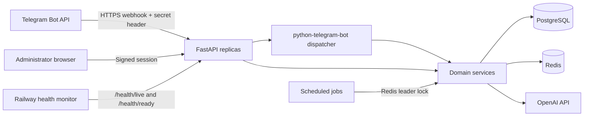

# NexusAI Architecture

**Author:** Manus AI  
**Status:** Production implementation blueprint

## 1. System context

NexusAI is an event-driven Telegram application served by a FastAPI process. Telegram delivers updates to a single HTTPS webhook, FastAPI verifies the webhook secret, and `python-telegram-bot` dispatches each update to modular handlers. PostgreSQL is the system of record. Redis provides short-lived caches, distributed rate limits, idempotency markers, and coordination for scheduled work. OpenAI requests are isolated behind a provider interface so the application can change model vendors or add fallbacks without modifying Telegram handlers.

Telegram supports HTTPS webhook delivery, configurable update types, a verification secret header, and up to 100 concurrent webhook connections.[1] Railway automatically detects a repository-level Dockerfile and supports deployment configuration stored with the application.[2]

| Layer | Responsibility | Scaling characteristic |
| --- | --- | --- |
| Edge/API | FastAPI webhook, health probes, admin HTTP routes | Stateless; may run as multiple replicas |
| Bot application | Command, callback, and message dispatch | Stateless handlers backed by PostgreSQL and Redis |
| Domain services | Chat, plans, referrals, premium, news, prompts, admin operations | Transactional and testable independently of transport |
| Persistence | SQLAlchemy repositories and PostgreSQL | Durable system of record with indexed access paths |
| Cache/control plane | Redis | Shared rate limits, cache entries, locks, and job coordination |
| AI provider | OpenAI-compatible async client | Bounded concurrency, timeouts, retries, and usage accounting |
| Background worker | APScheduler jobs for news ingestion and premium expiry | Singleton jobs protected by Redis locks |

## 2. Deployment topology

The default Railway topology contains one `web` service built from the Dockerfile, one PostgreSQL service, and one Redis service. FastAPI and the Telegram dispatcher share the same process so the webhook can acknowledge accepted updates without an additional broker. Scheduled jobs run in the web process but acquire a Redis leader lock before executing, preventing duplicate news refreshes when several replicas are active.

For larger installations, the transport and worker can be split without changing domain logic. The webhook service can enqueue normalized update identifiers to a durable queue, while worker replicas process them asynchronously. The first release intentionally avoids that operational complexity while preserving clean interfaces for the later split.

## 3. Domain model

The schema uses UUID primary keys for internal entities and preserves Telegram identifiers as indexed, unique big integers. Monetary values are stored as integer minor units. Time is stored as timezone-aware UTC timestamps.

| Entity | Purpose | Important constraints |
| --- | --- | --- |
| `users` | Registered Telegram users, roles, status, quota metadata | Unique `telegram_id` and `referral_code`; self-referral is rejected |
| `chat_sessions` | User-owned conversation threads | One active thread may be selected per user |
| `chat_messages` | Conversation history and usage metadata | Indexed by `(session_id, created_at)` |
| `ai_tools` | Curated AI tools directory | Unique slug; active/category indexes |
| `prompts` | Prompt-library entries | Unique slug; premium and featured flags |
| `news_items` | Deduplicated AI news stories | Unique source URL/hash; publication index |
| `referrals` | Immutable inviter/invitee relationship and rewards | Unique invitee; inviter cannot equal invitee |
| `subscriptions` | Premium state and provider references | Time-bounded status; external payment reference unique when present |
| `usage_events` | Auditable AI token/request usage | Indexed by user and event time |
| `audit_logs` | Administrative and security-sensitive actions | Actor, action, target, metadata, timestamp |

## 4. Request and update lifecycle

The webhook path is deliberately narrow. It validates the `X-Telegram-Bot-Api-Secret-Token` header using constant-time comparison, parses an update through `telegram.Update.de_json`, and passes it to the initialized Telegram application. Telegram update IDs are recorded briefly in Redis to make retries idempotent. Handler exceptions are captured by a central error callback, logged with correlation data, and converted to a safe user-facing response.

AI chat follows a bounded pipeline. The service verifies user status and plan allowance, applies a distributed per-user rate limit, loads a capped history window, calls the OpenAI provider with explicit timeouts, persists both messages and token usage in one transaction, and updates a short-lived quota cache. The provider layer retries only transient failures with exponential backoff and never retries invalid requests.

## 5. Security boundaries

| Boundary | Control |
| --- | --- |
| Telegram to FastAPI | HTTPS endpoint plus constant-time validation of Telegram’s secret header |
| Admin browser to dashboard | Password verification with Argon2, signed HTTP-only cookie, secure-cookie option, CSRF token on every state-changing form |
| Application to OpenAI | Server-only API key, strict request timeout, bounded output tokens, no secret logging |
| Application to databases | Credentials supplied through environment variables; least-privilege production database user recommended |
| User-generated content | HTML escaping for Telegram HTML messages; templates auto-escape; validated lengths and URLs |
| Abuse prevention | Redis sliding-window rate limits, daily plan quotas, blocked-user status, bounded message sizes |
| Operations | Structured logs, request IDs, liveness/readiness probes, immutable audit records |

The application does not store Telegram bot tokens, OpenAI keys, admin passwords, or payment secrets in source control. The `.env.example` file contains placeholders only. Dashboard sessions are signed and expire automatically. Production deployments should set `COOKIE_SECURE=true`, use a long random `SECRET_KEY`, choose a separate random `TELEGRAM_WEBHOOK_SECRET`, and restrict dashboard access at the network layer when possible.

## 6. Reliability and consistency

Database transactions protect registration, referral creation, reward allocation, premium activation, and usage recording. PostgreSQL uniqueness constraints provide the final defense against duplicate Telegram deliveries. Redis is treated as an accelerant rather than the durable source of truth: cache loss may reduce performance but must not corrupt user or subscription data.

OpenAI calls use connect/read/write/pool timeouts and bounded retries. News ingestion deduplicates by canonical URL and continues past individual feed errors. Background jobs use a Redis lock with an expiry longer than the expected job duration. Health probes distinguish process liveness from dependency readiness so Railway can avoid sending traffic to an instance that cannot reach PostgreSQL or Redis.

## 7. Capacity strategy

The web tier is stateless and horizontally scalable. PostgreSQL connection pools are deliberately small per replica to prevent aggregate connection exhaustion. Redis operations are constant-time for rate limits and cached directory queries. Long chat histories are not sent to the model; the application uses a configurable recent-message window and stores the full audit history separately.

At thousands of users, the principal cost and latency driver is the AI provider. NexusAI therefore accounts for every request, limits free-plan usage, caps response tokens, and exposes operational usage totals in the dashboard. If webhook latency becomes material, the existing service boundary allows moving update processing to a durable queue without changing handlers or repositories.

## 8. Extension points

The `AIProvider` protocol allows model fallback or a second vendor. Payment processing is represented by a service boundary and provider-neutral subscription fields; Telegram Stars or Stripe webhooks can be added later without changing premium checks. Feed adapters implement a small news-source contract. Admin routes call domain services rather than issuing ad hoc SQL.

## References

[1]: https://core.telegram.org/bots/api#setwebhook "Telegram Bot API — setWebhook"
[2]: https://docs.railway.com/guides/fastapi "Railway Guides — Deploy a FastAPI App"
