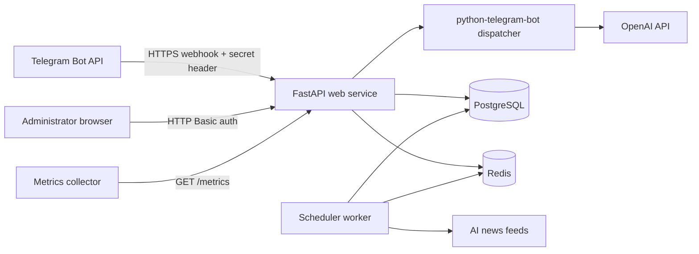

# NexusAI

**NexusAI** is a production-oriented Telegram AI platform built with **Python 3.12**, **FastAPI**, **python-telegram-bot**, **PostgreSQL**, **Redis**, **OpenAI**, and **Docker**. It combines an AI assistant, curated AI-tool discovery, AI news, a prompt library, referrals, premium memberships, and an authenticated operations dashboard in one scalable service.

The application uses Telegram webhooks instead of polling. PostgreSQL stores durable business data; Redis provides request throttling, caching, and distributed job coordination. A separate worker refreshes news and expires memberships without coupling scheduled work to web replicas.

## Feature set

| Area | Included behavior |
|---|---|
| Telegram experience | `/start`, `/menu`, `/help`, `/cancel`, inline menus, account view, and callback navigation |
| AI chat | OpenAI integration, bounded history, usage accounting, input validation, quotas, and chat reset |
| AI tools | Categorized directory with featured tools and external links |
| AI news | RSS/Atom ingestion, duplicate-safe persistence, cached browsing, and scheduled refresh |
| Prompt library | Categories, featured prompts, premium-only prompts, and Telegram-safe rendering |
| Registration | Idempotent account creation from Telegram profile data |
| Referrals | Unique invite codes, first-registration attribution, and exactly-once premium rewards |
| Premium | Higher quotas, expiry handling, admin grants, optional Telegram invoices, and payment records |
| Administration | Password-protected dashboard, metrics, users, block controls, premium grants, and news refresh |
| Operations | Health checks, Prometheus metrics, structured logs, request IDs, migrations, CI, and graceful shutdown |
| Deployment | Multi-stage non-root image, Compose stack, and separate Railway web/worker manifests |

## Architecture



Telegram supports HTTPS webhooks and can attach a configured secret in the `X-Telegram-Bot-Api-Secret-Token` header; NexusAI validates it before enqueueing an update.[1] Railway can build a repository-level Dockerfile and provide a public domain for the webhook.[2]

| Process | Responsibility | Scaling model |
|---|---|---|
| `web` | Webhook validation and dispatch, dashboard/API, health, metrics | Horizontally scalable; durable state remains external |
| `worker` | News refresh and premium-expiry jobs | Multiple replicas are safe because Redis ownership locks prevent concurrent duplicate work |
| PostgreSQL | Users, chats, messages, prompts, tools, news, subscriptions, referrals, payments | Durable source of truth with configurable pools |
| Redis | Rate windows, counters/cache, and job locks | Shared low-latency coordination layer |

See [`ARCHITECTURE.md`](ARCHITECTURE.md) for the domain model, request flows, security boundaries, and scaling assumptions.

## Repository layout

```text
nexusai/
├── app/
│   ├── api/                 # Health, webhook, admin dashboard, and admin APIs
│   ├── bot/                 # Telegram application, keyboards, utilities, handlers
│   ├── core/                # Settings, logging, and security helpers
│   ├── db/                  # Async PostgreSQL sessions and Redis wrapper
│   ├── models/              # SQLAlchemy domain entities
│   ├── repositories/        # Database access boundaries
│   ├── schemas/             # API request/response models
│   ├── services/            # AI, chat, users, news, premium, rate limiting
│   ├── workers/             # Scheduled jobs and worker entrypoint
│   ├── main.py              # FastAPI lifecycle and application assembly
│   └── observability.py     # Request context and Prometheus instrumentation
├── migrations/              # Alembic environment and initial schema
├── scripts/                 # Password, seed, and deployment utilities
├── tests/                   # Async service, transport, security, and resilience tests
├── .github/workflows/ci.yml # Lint, tests, migration cycle, and image build
├── Dockerfile
├── docker-compose.yml
├── railway.toml             # Railway web service
└── railway.worker.toml      # Railway worker service
```

## Prerequisites

For containerized development, install Docker Engine with the Compose plugin. Host-based development requires Python 3.12, PostgreSQL, and Redis. You also need a Telegram bot token from **BotFather**, an OpenAI API key, and an HTTPS public URL for webhook delivery outside local-only testing.

> **Secret handling:** never commit `.env`, bot tokens, API keys, payment-provider tokens, raw administrator passwords, or session secrets. The supplied `.gitignore` excludes `.env`.

## Quick start with Docker Compose

Clone the repository, create the environment file, and generate secure administrator values:

```bash
git clone <your-repository-url> nexusai
cd nexusai
cp .env.example .env
python scripts/hash_password.py
python -c "import secrets; print(secrets.token_urlsafe(64))"
python -c "import secrets; print(secrets.token_urlsafe(32))"
```

Place the Argon2 output in `ADMIN_PASSWORD_HASH`, the 64-byte random value in `SECRET_KEY`, and the final token in `TELEGRAM_WEBHOOK_SECRET`. Set `TELEGRAM_BOT_TOKEN`, `OPENAI_API_KEY`, and `PUBLIC_BASE_URL` in `.env`. `PUBLIC_BASE_URL` must be the externally reachable HTTPS origin without a trailing slash.

Start the stack:

```bash
docker compose up --build -d
docker compose logs -f web worker
```

The `web` container waits for PostgreSQL and Redis health, applies `alembic upgrade head`, and starts Uvicorn. Seed initial tools and prompts after services are healthy:

```bash
docker compose exec web python scripts/seed.py
```

Confirm service state:

```bash
curl http://localhost:8000/health/live
curl http://localhost:8000/health/ready
```

When `PUBLIC_BASE_URL` points to the running HTTPS service, FastAPI startup registers `${PUBLIC_BASE_URL}${TELEGRAM_WEBHOOK_PATH}` with Telegram automatically.

## Host-based development

```bash
python3.12 -m venv .venv
source .venv/bin/activate
python -m pip install --upgrade pip
python -m pip install -e '.[dev]'
cp .env.example .env
```

Update `.env` for your local PostgreSQL and Redis services, then initialize and run:

```bash
alembic upgrade head
python scripts/seed.py
uvicorn app.main:app --reload --host 0.0.0.0 --port 8000
```

Run the scheduler in a second terminal:

```bash
source .venv/bin/activate
python -m app.workers.scheduler
```

A valid Telegram token is required because application initialization creates the bot client. For local webhook testing, use an HTTPS tunnel, set `PUBLIC_BASE_URL` to its origin, and restart the API so the webhook is re-registered.

## Configuration

Settings are loaded from environment variables with `pydantic-settings`. Secret values are represented as secret types and are not intended to be logged.

| Variable | Required | Purpose |
|---|---:|---|
| `ENVIRONMENT` | Yes | `development`, `test`, or `production`; API docs are disabled in production |
| `PUBLIC_BASE_URL` | Yes | Public HTTPS origin used to construct the Telegram webhook URL |
| `PORT` | Yes | Web listener port; Railway injects this |
| `DATABASE_URL` | Yes | Async SQLAlchemy URL, normally `postgresql+asyncpg://...` |
| `REDIS_URL` | Yes | Redis connection URL |
| `TELEGRAM_BOT_TOKEN` | Yes | BotFather token |
| `TELEGRAM_WEBHOOK_SECRET` | Yes | Header secret accepted by the webhook endpoint |
| `TELEGRAM_WEBHOOK_PATH` | Yes | Webhook path, default `/webhooks/telegram` |
| `OPENAI_API_KEY` | Yes | OpenAI API credential |
| `OPENAI_MODEL` | Yes | Model used by AI chat |
| `FREE_DAILY_MESSAGES` | Yes | Free-plan daily AI allowance |
| `PREMIUM_DAILY_MESSAGES` | Yes | Premium-plan daily AI allowance |
| `RATE_LIMIT_REQUESTS` | Yes | Accepted requests in each Redis rate window |
| `RATE_LIMIT_WINDOW_SECONDS` | Yes | Sliding-window duration |
| `ADMIN_USERNAME` | Yes | HTTP Basic dashboard username |
| `ADMIN_PASSWORD_HASH` | Yes | Argon2 hash produced by `scripts/hash_password.py` |
| `SECRET_KEY` | Yes | Secret used by signed administrative session utilities |
| `NEWS_FEED_URLS` | Yes | Comma-separated RSS/Atom URLs consumed by the worker |
| `TELEGRAM_PAYMENT_PROVIDER_TOKEN` | No | Enables Telegram premium checkout |

Review [`.env.example`](.env.example) for pool, history, timeout, scheduling, cookie, quota, and pricing controls.

## Telegram experience

| Entry point | Behavior |
|---|---|
| `/start [referral_code]` | Creates or updates the user, applies eligible referral attribution once, and opens the menu |
| `/menu` | Returns to the main menu and exits chat mode |
| `/help` | Displays navigation help |
| `/cancel` | Exits AI chat mode |
| AI Chat | Enables free-form AI messages with history, quotas, and rate limiting |
| AI Tools | Opens featured and categorized directory views |
| AI News | Displays recent persisted articles |
| Prompt Library | Browses categories and enforces premium-only access |
| Premium | Shows account tier and optionally starts invoice checkout |
| Referrals | Shows the user’s deep link and successful referral count |
| Account | Shows plan and usage information |

User-generated and feed-derived text is escaped for Telegram HTML. Callback identifiers are validated before database queries, and webhook updates require the configured Telegram secret header.

## Administrator dashboard

Open `https://<your-domain>/admin` and authenticate with `ADMIN_USERNAME` and the original password whose hash is stored in `ADMIN_PASSWORD_HASH`.

| Endpoint | Method | Operation |
|---|---|---|
| `/api/admin/stats` | `GET` | Aggregate platform statistics |
| `/api/admin/users` | `GET` | Paginated users and account state |
| `/api/admin/users/{telegram_id}/block` | `POST` | Block or unblock an account |
| `/api/admin/users/{telegram_id}/premium` | `POST` | Grant premium days |
| `/api/admin/news/refresh` | `POST` | Run news ingestion immediately |

Mutations require HTTP Basic authentication and `X-Admin-Action: NexusAI`, adding protection against accidental or cross-origin state changes. This does not replace TLS, strong credentials, or access controls.

```bash
curl --user "$ADMIN_USERNAME:$ADMIN_PASSWORD" \
  https://<your-domain>/api/admin/stats

curl --user "$ADMIN_USERNAME:$ADMIN_PASSWORD" \
  -H 'Content-Type: application/json' \
  -H 'X-Admin-Action: NexusAI' \
  -d '{"days":30}' \
  https://<your-domain>/api/admin/users/123456789/premium
```

## Premium and payments

Premium can be granted by referral rewards, administrators, or Telegram payment confirmation. Active membership grants extend from the current expiry; expired membership starts from the current time. The worker marks expired subscriptions inactive every 15 minutes.

Checkout is disabled when `TELEGRAM_PAYMENT_PROVIDER_TOKEN` is empty. Once configured, the bot sends an invoice, validates the pre-checkout payload, stores the Telegram charge reference, and activates 30 days after successful payment. Operators remain responsible for provider onboarding, taxes, refunds, chargebacks, disclosures, and jurisdiction-specific obligations.

## Background jobs

Run `python -m app.workers.scheduler` independently. It refreshes news every `NEWS_REFRESH_MINUTES` and expires premium every 15 minutes. Each job uses a Redis lock with a unique owner token and atomic compare-and-delete release, allowing safe worker redundancy.

Initial content seeding is idempotent:

```bash
python scripts/seed.py
```

## Railway deployment

Deploy two Railway services from the same repository: a public **web** service and a non-public **worker**. Add managed PostgreSQL and Redis, then share their connection variables with both application services. Full instructions are in [`docs/RAILWAY.md`](docs/RAILWAY.md).

The web service uses [`railway.toml`](railway.toml), applies migrations as a pre-deploy command, binds Uvicorn to `$PORT`, and uses `/health/ready`. The worker uses [`railway.worker.toml`](railway.worker.toml) and starts `python -m app.workers.scheduler`.

> Run migrations as a controlled deployment step, not independently from every web replica. The provided web manifest uses `alembic upgrade head` before startup.[2]

After Railway assigns a domain, set `PUBLIC_BASE_URL=https://<assigned-domain>` on both application services and redeploy web. Confirm readiness, inspect logs for `telegram_webhook_configured`, and send `/start`.

## Database migrations

```bash
alembic upgrade head
alembic revision --autogenerate -m "describe the change"
```

Before release, review generated revisions and test downgrade/upgrade behavior against disposable data:

```bash
alembic downgrade base
alembic upgrade head
```

Take a verified production backup before destructive changes and prefer backward-compatible expand/migrate/contract changes for large tables.

## Quality checks

The test suite covers registration, referral rewards, premium stacking and expiry, AI chat usage and quotas, webhook authentication, security helpers, Redis rate limiting, and distributed job locks.

```bash
ruff format --check app tests
ruff check app tests
mypy app --ignore-missing-imports --check-untyped-defs
pytest --cov=app --cov-report=term-missing
python scripts/validate_deployment.py
```

GitHub Actions runs linting, tests, an Alembic upgrade/downgrade cycle, and a Docker build on pushes and pull requests.

## Health, metrics, and logging

| Endpoint or signal | Meaning |
|---|---|
| `/health/live` | Process is running |
| `/health/ready` | PostgreSQL and Redis are reachable; HTTP 503 otherwise |
| `/metrics` | Prometheus text exposition for requests and durations |
| `X-Request-ID` | Accepted or generated per request for correlation |
| Structured logs | Environment, level, module, timestamp, and contextual request/job data |

Protect `/metrics` at the platform, proxy, or private-network layer if it should not be public.

## Security checklist

Before launch, replace every placeholder, use unique administrator credentials, keep `COOKIE_SECURE=true`, require HTTPS, restrict dashboard access, configure provider-side budgets, and document key rotation and incident response. Ensure extensions never log prompts, tokens, payment secrets, passwords, or API credentials.

Keep PostgreSQL and Redis on the Railway private network or equivalent. Use least-privilege database credentials, managed backups, retention, and tested restoration. Quotas and rate limits are product controls rather than a complete abuse-defense system; monitor cost, webhook errors, provider latency, queue pressure, and blocked-user activity.

## Troubleshooting

| Symptom | Likely cause and action |
|---|---|
| `/health/ready` returns 503 | Check database/Redis URLs, service references, migrations, and private networking |
| Bot does not answer | Check HTTPS domain, token, secret character rules, webhook path, and startup logs |
| Telegram returns unauthorized | Regenerate the BotFather token, update both services, and redeploy |
| AI chat fails | Check OpenAI key, model access, provider limits, timeout, and outbound networking |
| Premium button is absent | Configure `TELEGRAM_PAYMENT_PROVIDER_TOKEN`; empty intentionally disables checkout |
| News is empty | Start the worker, validate feed URLs, inspect logs, and trigger admin refresh |
| Admin authentication fails | Confirm username and regenerate the Argon2 hash from the intended password |
| Scheduled work duplicates | Confirm every worker shares the same Redis service |

## Additional documentation

[`docs/INSTALLATION.md`](docs/INSTALLATION.md) is the full installation checklist. [`docs/RAILWAY.md`](docs/RAILWAY.md) covers deployment. [`docs/OPERATIONS.md`](docs/OPERATIONS.md) covers verification, monitoring, recovery, and runbooks. [`ARCHITECTURE.md`](ARCHITECTURE.md) documents internals.

## License

No license has been selected. Add one before distributing the project outside your organization.

## References

[1]: https://core.telegram.org/bots/api#setwebhook "Telegram Bot API — setWebhook"
[2]: https://docs.railway.com/guides/fastapi "Railway Docs — Deploy a FastAPI App"
